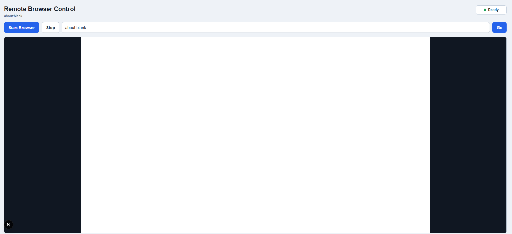
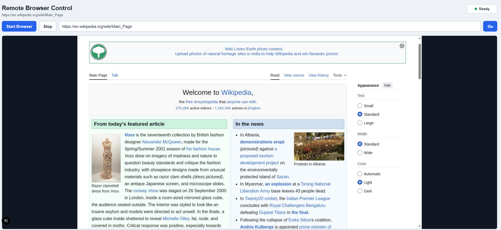

# Remote Browser Control

A local remote-browser experience built for real-world demos. This app launches Chromium in Docker, streams its screen back to your browser in real time, and forwards clicks, scrolls, and keystrokes into the remote browser.

It is designed to show a complete local end-to-end flow:

- one-click browser startup
- live screen streaming over WebSocket
- interactive input forwarding into headless Chromium
- URL navigation from the UI

## Why this matters

This project proves a practical remote-browser control system without any cloud dependencies. It is useful for:

- demos of real-time browser automation
- local browser testing and control workflows
- teaching how Chrome DevTools Protocol can power remote interaction

## Features

- Local web UI with Start Browser and Stop controls
- Dockerized Chromium running in headless mode
- Chrome DevTools Protocol connection from the Node backend
- Real-time screencast frames streamed to the UI over WebSocket
- Mouse move, click, scroll, and keyboard events forwarded into Chromium
- URL bar for navigating the remote browser
- Refresh control and recent URL history for faster workflows

## Demo

### Before navigation



*The UI immediately after the browser starts, before a destination is entered.*

### After navigation



*The browser page after navigating to a remote URL.*

## Requirements

- Node.js 20+
- npm
- Docker Desktop installed and running
- Windows users: WSL 2 enabled and updated

Check Docker with:

```bash
docker --version
```

If that command fails, install Docker Desktop and restart your terminal.

Some Windows installs place Docker Desktop under the current user's profile instead of `C:\Program Files`. For this terminal session, you can add that Docker CLI path with:

```powershell
$env:Path += ";$env:LOCALAPPDATA\Programs\DockerDesktop\resources\bin"
docker --version
docker info
```

On Windows, if Docker says WSL is missing or too old, open PowerShell as Administrator and run:

```powershell
wsl --install
wsl --update
```

If `wsl --update` does not work through the Microsoft Store path, try:

```powershell
wsl --update --web-download
```

Restart Windows after installing or updating WSL, then open Docker Desktop again.

## Run Locally

Install dependencies:

```bash
npm install
```

Start the app:

```bash
npm run dev
```

Open:

```text
http://localhost:3000
```

Click **Start Browser**. The first start builds the Chromium Docker image, so it can take a little longer. After the browser appears, click inside the viewport before typing.

## Useful Commands

Build the Chromium image manually:

```bash
npm run browser:build
```

Stop and remove the browser container:

```bash
npm run browser:stop
```

Type-check the project:

```bash
npm run typecheck
```

Build the Next.js app:

```bash
npm run build
```

## Architecture

```text
Next.js UI
  |
  | WebSocket frames and input events
  v
Custom Node server
  |
  | Docker CLI
  v
Chromium container
  |
  | Chrome DevTools Protocol
  v
Headless Chromium page
```

The custom Node server serves the Next.js app and owns the WebSocket endpoint at `/ws`. When the UI sends a start command, the server builds the Docker image, starts the Chromium container, connects to Chromium over CDP on port `9222`, starts a screencast, and forwards frames to the frontend.

Frontend mouse and keyboard events are translated into CDP `Input.dispatchMouseEvent` and `Input.dispatchKeyEvent` calls.

## Reviewer highlights

- **End-to-end local demo:** UI → server → Docker → Chromium → CDP → canvas.
- **Tested flow:** `scripts/smoke.mjs` validates startup, navigation, screencast, and input.
- **Documentation:** includes `CHANGELOG.md`, `DEVNOTES.md`, and `AUTHORS` for traceability.
- **Real implementation:** not a stub — it runs a live browser session inside Docker and streams frames back to the browser.
- **Contributors:** `vbhati15` is listed in `AUTHORS` for this project.

## Limitations

- Docker must be installed locally and available on PATH.
- Streaming is CDP screencast based, so it is suitable for an assignment demo but not as smooth as a production remote desktop protocol.
- Clipboard sync, downloads, audio, and multi-tab controls are not implemented.
- Some websites may block headless or automated browser environments.
